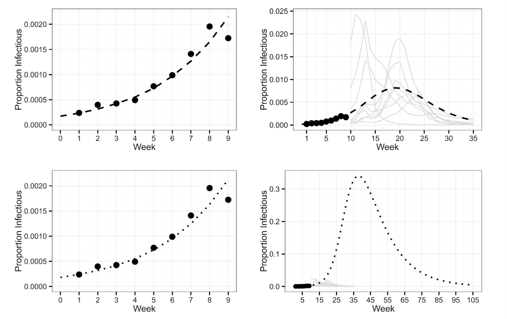
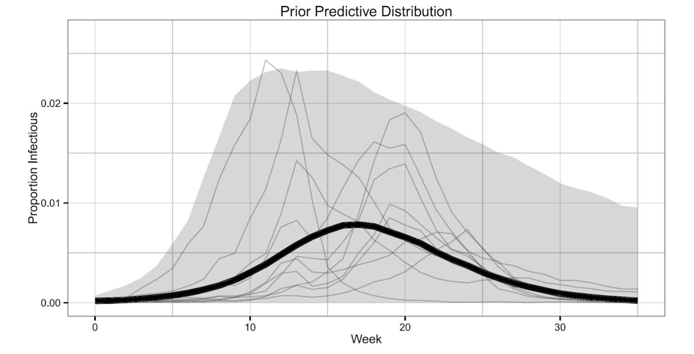
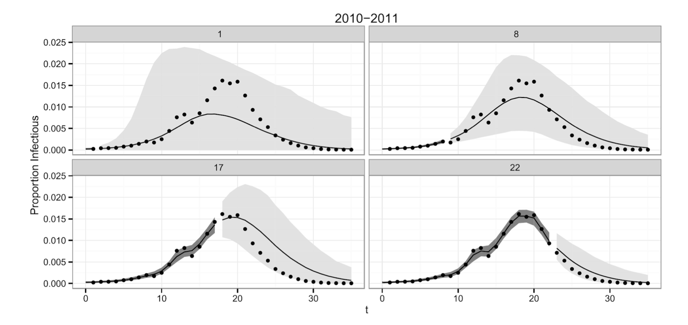

```{r setup, include=FALSE}
knitr::opts_chunk$set(echo = F, cache = T, message = F)
# devtools::install_github("lilywang1988/eSIR")
# devtools::install_github("GuangchuangYu/nCov2019")
# devtools::install_github("qingyuanzhao/2019-nCov-Data")
library(tidyverse)
library(deSolve)
library(eSIR) 
library(nCov2019) 
library(bets.covid19) 
source("functions.R")
theme_set(theme_bw())
```

# SIR

Simple mathematical model formulated model spread of a disease through a population by tracking change in compartments [@kermack1927contribution]

</br>

- S: Susceptible Proportion/Size

</br>

- I: Infected Proportion/Size 

</br>

- R: Recovered Proportion/Size 


```{r, fig.height = 2, fig.width = 4}

```


# SIR

<br/>

\[
\frac{dS}{dt} = - \beta S I \quad \quad \frac{dI}{dt} = \beta S I - \gamma I \quad \quad \frac{dR}{dt} = \gamma I
\]

<br/>

$\beta$: disease transmission rate 

$\gamma$: recovery rate (reciprocal is average recovery rate)

$S + I + R = 1$ for all time points. 

If $S_0 < \frac{\gamma}{\beta}$, infections decrease monotonically 

Basic Reproductive Ratio ($R_0$): $\frac{\beta}{\gamma}$

- For more basic results, see [@bjornstad2018epidemics]

# Simulating

- Due to numerical instabilities common in nonlinear ordinary differential equations, often must use numerical solvers such as Euler's method, or other Runge-Kutta methods. 

</br>

- In practice, many ODE solvers available

# SIR Simulation - Discrete [@bjornstad2018epidemics]

```{r, fig.width = 8, fig.height = 5}
sir_simulate_discrete(t = 30, beta = 2, gamma = 1.4, I_0 = 0.0002, R_0 = 0.0998) %>% 
  rename(Susceptible = S,
         Infected = I,
         Recovered = R) %>% 
  mutate(time = 1:(nrow(.)) - 1) %>% 
  pivot_longer(cols = c("Susceptible", "Infected", "Recovered"),
               names_to = "variable",
               values_to = "value") %>% 
  mutate(variable = factor(variable, levels = c("Susceptible", "Infected", "Recovered"))) %>% 
  ggplot(aes(x = time, y = value)) + 
  geom_line(aes(colour = variable)) +
  ylim(c(0, 1)) + 
  labs(title = expression("SIR: "~beta~" = 2, "~gamma~" = 1.4, "~S[0]~" = 0.9, "~I[0]~" = 0.0002, "~R[0]~" = 0.0998"),
       x = "Time",
       y = "Proportion",
       colour = "Compartment")
```


# SIR Simulation - Discrete

```{r, fig.width = 8, fig.height = 5}
sir_simulate_discrete(t = 30, beta = 4, gamma = .4, I_0 = 0.0002, R_0 = 0.0998) %>% 
  rename(Susceptible = S,
         Infected = I,
         Recovered = R) %>% 
  mutate(time = 1:(nrow(.)) - 1) %>% 
  pivot_longer(cols = c("Susceptible", "Infected", "Recovered"),
               names_to = "variable",
               values_to = "value") %>% 
  mutate(variable = factor(variable, levels = c("Susceptible", "Infected", "Recovered"))) %>% 
  ggplot(aes(x = time, y = value)) + 
  geom_line(aes(colour = variable)) +
  ylim(c(0, 1)) + 
  labs(title = expression("SIR: "~beta~" = 4, "~gamma~" = 0.4, "~S[0]~" = 0.99, "~I[0]~" = 0.0002, "~R[0]~" = 0.0998"),
       x = "Time",
       y = "Proportion",
       colour = "Compartment")
```

# SIR Simulation - Numerical 

```{r, fig.width = 8, fig.height = 5}
sir_simulate_numerical(t = 30, beta = 4, gamma = .4, I_0 = 0.0002, R_0 = 0.0998) %>% 
  rename(Susceptible = S,
         Infected = I,
         Recovered = R) %>% 
  mutate(time = 1:(nrow(.)) - 1) %>% 
  pivot_longer(cols = c("Susceptible", "Infected", "Recovered"),
               names_to = "variable",
               values_to = "value") %>% 
  mutate(variable = factor(variable, levels = c("Susceptible", "Infected", "Recovered"))) %>% 
  ggplot(aes(x = time, y = value)) + 
  geom_line(aes(colour = variable)) +
  ylim(c(0, 1)) + 
  labs(title = expression("SIR: "~beta~" = 4, "~gamma~" = 0.4, "~S[0]~" = 0.99, "~I[0]~" = 0.0002, "~R[0]~" = 0.998"),
       x = "Time",
       y = "Proportion",
       colour = "Compartment")
```

# SIR Simulation - Numerical 

```{r, fig.width = 8, fig.height = 5}
sir_simulate_numerical(t = 30, beta = 2, gamma = 2, I_0 = .2, R_0 = 0) %>% 
  rename(Susceptible = S,
         Infected = I,
         Recovered = R) %>% 
  mutate(time = 1:(nrow(.)) - 1) %>% 
  pivot_longer(cols = c("Susceptible", "Infected", "Recovered"),
               names_to = "variable",
               values_to = "value") %>% 
  mutate(variable = factor(variable, levels = c("Susceptible", "Infected", "Recovered"))) %>% 
  ggplot(aes(x = time, y = value)) + 
  geom_line(aes(colour = variable)) +
  ylim(c(0, 1)) + 
  labs(title = expression("SIR: "~beta~" = 2, "~gamma~" = 2, "~S[0]~" = 0.8, "~I[0]~" = 0.2, "~R[0]~" = 0"),
       x = "Time",
       y = "Proportion",
       colour = "Compartment")
```


# SIR Variations 
Variations include: 

</br>

- SEIR: Exposed compartment (disease onset latency) 

</br>

- SIRS: Temporary immunity 

</br>

- MSIR: Temporary maternal immunity 

</br>

- SILI: Latent non-infectious period (for bats) 

</br>

- Incorporating birth/death rates etc

</br>


# Epidemics Vs. Seasonal spread

Often goal is predicting spread of epidemics given certain parameters

</br>

- New strain of Flu
- COVID-19

Can also be used to study dynamics of endemic diseases

</br>

- Measles
- Rabies in animal populations


# Using Derministic SIR Models in Practice

- If estimates of $\beta$, $\gamma$ or $R_0$ are obtained, models can be use deterministically to propogate uncertainty

</br>

- There are many methods to estimating these parameters early in an epidemic, some more simple than others, especially when $S_0$ can be assumed high. These can provide "reasonable" trajectories.


# Bayesian State-Space Approaches

- Long tradition of frequentist methods to estimating compartamental models. 

- With advent of MCMC methods in the last few decades, Bayesian methods have gained more traction

# Bayesian Statistics Review

Want to approximate posterior distribution: $p(\theta | X)$

</br>

$p(\theta | X) = \frac{p(X| \theta) p(\theta)}{p(X)} \propto p(X | \theta) p(\theta)$

</br>

$p(X | \theta)$: Likelihood

</br>

$p(\theta)$: Prior, encodes a priori beliefs


# State-Space Review [@prado2010time]

State-space model can be formulated with **evolution** and **observation** equations. 

</br>

- **observation**: $y_t \sim p(y_t | \theta_t, \phi)$

</br>

- **evolution**: $\theta_t \sim p(\theta_t | \theta_{t - 1}, \phi)$

</br>

State-Space SIR models typically treat compartment proportions as latent "state" parameters, with observations often being some version of case counts.

# [@dukic2012tracking]

Use state-space SEIR model to track ILI (influenza-like-illness) from google flu trends. 
</br>

- $\tilde{I}_t$ (observed weekly ILI) treated as noisy approximation of $I_t$

</br>

- work with observed growth rate, $y_t = \frac{(\tilde{I}_t - \tilde{I}_{1 - 1})}{\tilde{I}_{t - 1}}$

</br>

- **observation** equation: $y_t = g_t + \epsilon^y_t \quad \epsilon^y_t \sim N(0, \sigma^2_y)$

</br>

- **evolution** equation (growth rate): $g_t = -\gamma + \alpha \frac{E_{t - 1}}{I_{t - 1}} + \epsilon^g_t \quad \epsilon^g_t \sim N(0, \sigma^2_g)$

</br>

- **evolution** equation (other states): 

$$ \begin{pmatrix}
S_t \\
E_t \\ 
R_t
\end{pmatrix}
=
\begin{pmatrix} 
S_{t-1} \\
E_{t-1} \\ 
R_{t-1}
\end{pmatrix} + 
\begin{pmatrix}
-\frac{\beta S_{t - 1}}{N} & 0 \\
\frac{\beta S_{t - 1}}{N} & \alpha \\
\gamma & 0
\end{pmatrix}
\begin{pmatrix} 
I_{t-1} \\
E_{t-1} 
\end{pmatrix} $$


# [@osthus2017forecasting]

Use Dirichlet-Beta state-space model motivated by SIR model to forecast estimate of influenza prevalence(combination of weekly CDC ILInet data with NREVSS virologic surveillance data)

</br>

- **observation** equation: $y_t | \theta_t, \phi \sim Beta( \lambda \theta^I_t, \lambda(1 - \theta^I_t))$

</br>

- **evolution** equation: $\theta_t | \theta_{t - 1}, \phi \sim Dirichlet( \kappa f(\theta_{t - 1}, \beta, \gamma))$

</br>

Where $\theta_t = (\theta^S_t, \theta^I_t, \theta^R_t)$, and $f(\theta_{t - 1}, \beta, \gamma)$ is defined as previous SIR differential equations:

</br>

\[
\frac{dS}{dt} = - \beta \theta^S \theta^I \quad \quad \frac{dI}{dt} = \beta \theta^S \theta^I - \gamma I \quad \quad \frac{dR}{dt} = \gamma \theta^I
\]

# [@osthus2017forecasting]

**posterior** distribution: $p(\theta_{1:t'}, \phi| y_{1:t'}) \propto p(\phi) p(y_{1:t'}, \theta_{1:t'} | \phi) = p(\phi) \prod\limits^{t'}_{t = 1} p(y_t | \theta_t, \phi) p(\theta_t | \theta_{t - 1}, \phi)$

</br>

Where $\phi = [\kappa, \lambda, \theta_0, \rho, \beta]$, and $\rho = \frac{\gamma}{\beta}$

</br>

- Fitting of this model (in jags) is enabled with a clever introduction of latent variable $z = [PI, PT]$, and  specification of informative prior

# [@osthus2017forecasting]

```{r}

```

# Informative Priors [@osthus2017forecasting]

Decompose $p(\phi, z)$ as follows:

</br>

$$
p(\kappa, \lambda, \theta_0, z, \rho, \beta) = p(\kappa)p(\lambda | \kappa) p(\theta_0 | \lambda, \kappa) p(z | \theta_0, \lambda, \kappa) p(\rho |z, \theta_0, \lambda, \kappa) p(\beta | \rho, z, \theta_0, \lambda, \kappa)
$$
</br>

$$
= p(\kappa)p(\lambda) p(\theta_0) p(z | \theta_0) p(\rho | z, \theta_0) p(\beta | \rho, z, \theta_0)
$$
</br>

- $p(\theta^S_0) \sim \delta(\theta^S_0 - 0.9) \quad p(\theta^I_0) \sim Beta(1.62, \text{ }7084.1)$ i.e. small but large enough to cause epidemic. 

</br>

- $$p(z | \theta_0) = p(PI, PT) \sim TN(\mu = (0.0144, 17.9) \quad \Sigma = \begin{pmatrix}
0.000036 & -0.0187 \\
-0.0187 & 16.09
\end{pmatrix}, lower = (\theta^I_0, 1), upper=(1, 35))$$

</br>

- $p(\rho | z, \theta_0) \sim \delta (\rho - g^{-1}(PI, \theta^S_0, \theta^I_0)) \quad \text{ where } \quad PI = g(S_0, I_0, \rho) = I_0 + S_0 - \rho [log(S_0) + 1 - log(\rho)]$ i.e. $\rho$ deterministic given initial conditions and $PI$

</br>

- $p(\beta | \rho, z,, \theta_0)$ is estimated by simulating SIR curves or a range of reasonable $PT$ values. 


# [@osthus2017forecasting]

```{r}

```


# 95% Credible Intervals & Prediction Intervals [@osthus2017forecasting]

```{r}

```

# Extending to COVID-19 [@song2020epidemiological]

Song et al. extend Osthus' state-space formulation to COVID-19 in march 2020, introducing: 

</br>

- SIR model with time varying transmission rate to account for government responses

</br>

- SIR model with time varying quarantine rate to account for changes in enforced quarantine

</br>

- SIR with time-varying subset of population immunized with antibody positivity


# SIR model with time varying transmission rate [@song2020epidemiological]

Introduce $\pi(t)$ tramsmission parameter to SIR model, where $\pi(t) \in [0, 1]$, such that 

</br>

$$
\frac{\theta^S_t}{dt} = -\beta \pi(t) \theta^S_t \theta^I_t \quad \frac{d\theta^I_t}{dt} = \beta \pi(t) \theta^S_t \theta^I_t - \gamma \theta^I_t \quad \frac{d \theta^R_t}{dt} = \gamma \theta^I_t
$$
</br>

where, 

</br>

$$
\pi(t) = \begin{cases}
1.0 & \text{if} \quad t \leq \text{Jan 23} \\
0.9 & \text{if} \quad t \in \text{(Jan 23, Feb 4) city blockade} \\
0.5 & \text{if} \quad t \in \text{(Feb 4, Feb 8) enhanced quarantine} \\
0.1 & \text{if} \quad t \in \text{t > Feb 8 use of new hospitals}
\end{cases}
$$

# SIR model with time varying transmission rate [@song2020epidemiological]

```{r, results = "hide", fig.width = 10, fig.height = 6}
# code from https://github.com/lilywang1988/eSIR, all credit goes to Song et al.  

song_plot_tv_transmission(with_intervention = T)
```


# Without Intevention [@song2020epidemiological]

```{r, results = "hide", fig.width = 10, fig.height = 6}
# code from https://github.com/lilywang1988/eSIR, all credit goes to Song et al.  
song_plot_tv_transmission(with_intervention = F)
```


# SQIR model with time varying quarantine rate [@song2020epidemiological]


Again, introduce $\pi(t)$ tramsmission parameter to SIR model, where $\pi(t) \in [0, 1]$, but also introduce new Q compartment

</br>

$$
\frac{\theta^S_t}{dt} = - \beta \pi(t) \theta^S_t \theta^I_t - \phi(t)
\frac{\theta^Q_t}{dt} = \pi(t) \theta^S_t \quad
\theta^S_t \quad \frac{d\theta^I_t}{dt} = \beta \pi(t) \theta^S_t \theta^I_t - \gamma \theta^I_t \quad \frac{d \theta^R_t}{dt} = \gamma \theta^I_t
$$
</br>

where, 

</br>

$$
\pi(t) = \begin{cases}
0.1 & \text{if} \quad t = \text{Jan 23 city blockade} \\
0.4 & \text{if} \quad t = \text{Feb 4 enhanced quarantine} \\
0.4 & \text{if} \quad t = \text{Feb 8 use of new hospitals} \\
0 & \text{else},
\end{cases}
$$

# SAIR model with time varying quarantine rate [@song2020epidemiological]

```{r, results = "hide", fig.width = 10, fig.height = 6}
# code from https://github.com/lilywang1988/eSIR, all credit goes to Song et al.  
song_plot_tv_quarantine()
```


# SIR with time-varying subset of population immunized with antibody positivity [@song2020epidemiological]

Introduce $\alpha$ "unreported infection" parameter to account for those who develop antibodies (either due to self-care following infection or asymptomatic cases) to SIR model, where $\alpha \in [0, 1]$, as well as new A compartment. Here we assume $20 \%$ of cases go unreported. 

</br>

$$
\frac{\theta^S_t}{dt} = - \alpha \theta^S_t \theta^I_t  - \beta \theta^S_t \theta^I_t \quad
\frac{\theta^A_t}{dt} = \alpha \theta^S_t \theta^I_t \quad
\frac{d\theta^I_t}{dt} = \beta \theta^S_t \theta^I_t - \gamma \theta^I_t \quad \frac{d \theta^R_t}{dt} = \gamma \theta^I_t
$$

# SIR with time-varying subset of population immunized with antibody positivity [@song2020epidemiological]

```{r, results = "hide", fig.width = 10, fig.height = 6}
# code from https://github.com/lilywang1988/eSIR, all credit goes to Song et al.  
song_plot_tv_antibodies()
```


# References


